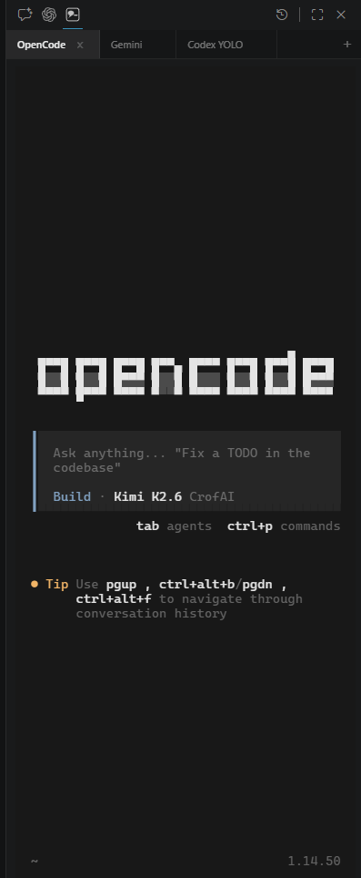
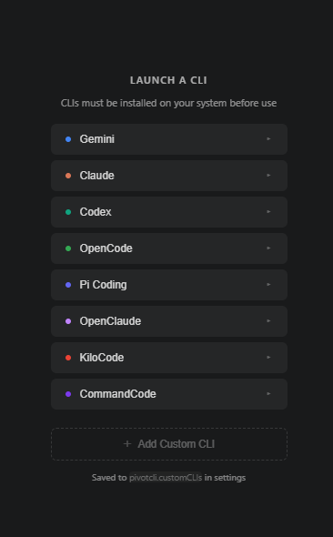

# PivotCLI

A VS Code extension that gives you a sidebar panel to launch AI coding CLI tools — right inside your editor. Run multiple sessions in tabs, switch between them, and multitask.

Supports Gemini, Claude, Codex, OpenCode, Pi Coding, OpenClaude, KiloCode, CommandCode — and any custom CLI you configure.

<p align="center">
  
  &nbsp;&nbsp;
  
</p>

## Supported CLIs

| CLI | Normal | YOLO Mode |
|-----|--------|-----------|
| [Gemini CLI](https://github.com/google-gemini/gemini-cli) | `gemini` | `gemini -y` |
| [Claude Code](https://docs.anthropic.com/en/docs/claude-code) | `claude` | `claude --dangerously-skip-permissions` |
| [Codex CLI](https://github.com/openai/codex) | `codex` | `codex --dangerously-bypass-approvals-and-sandbox` |
| [OpenCode](https://github.com/opencode-ai/opencode) | `opencode` | — |
| [Pi Coding](https://pi.dev) | `pi` | — |
| [OpenClaude](https://github.com/badkobzaar/openclaudecodecli) | `openclaude` | `openclaude --dangerously-skip-permissions` |
| [KiloCode](https://github.com/kilocode/kilo) | `kilo` | — |
| [CommandCode](https://github.com/CommandCode/command-code) | `npx command-code` | `npx command-code --yolo` |
| **Custom** | _any command_ | _optional_ |

## Features

- Launch any supported CLI from a clean homepage
- **Custom CLI support** — add your own tools via `pivotcli.customCLIs` in settings, no extension update needed
- Multi-tab support — run multiple CLIs simultaneously
- Flat square tab bar with activity indicators
- **Tab persistence** — open tabs are restored automatically after VS Code restarts
- YOLO mode for Gemini, Claude, Codex, OpenClaude & CommandCode
- Embedded terminal powered by xterm.js with full PTY support
- Session history — quickly relaunch previous sessions

## Custom CLIs

Add any CLI to the launcher panel via VS Code settings. Click **+ Add Custom CLI** in the panel, or edit `settings.json` directly:

```json
"pivotcli.customCLIs": [
  {
    "name": "Aider",
    "command": "aider",
    "yoloCommand": "aider --yes",
    "color": "#ff6b35"
  },
  {
    "name": "Amp",
    "command": "amp"
  }
]
```

| Field | Required | Description |
|-------|----------|-------------|
| `name` | ✓ | Display name in the launcher |
| `command` | ✓ | Shell command to run (must be on PATH) |
| `yoloCommand` | — | Enables a YOLO Mode sub-option |
| `color` | — | Dot color (any CSS color, e.g. `"#ff6b35"`) |

Changes apply instantly — no reload required.

## Requirements

The CLI tools you want to use must be installed and available on your PATH.

## Installation

### From VS Code Marketplace

Search for **PivotCLI** in the Extensions panel, or install from the [Marketplace page](https://marketplace.visualstudio.com/items?itemName=KamrulHasan.pivotcli).

### From Source

```bash
git clone https://github.com/kamrulbds725/PivotCLI.git
cd PivotCLI
npm install
npm run compile
npx @vscode/vsce package
```

Then install the generated `.vsix` file.

## Usage

1. Click the **PivotCLI** icon in the Activity Bar
2. Choose a CLI from the homepage (click to expand YOLO options)
3. Click **+ Add Custom CLI** to configure your own tools
4. Click `+` to open more tabs while existing sessions keep running
5. Switch between tabs — activity spinner shows which CLIs are working
6. Use the history icon to relaunch previous sessions
7. Tabs reopen automatically the next time you launch VS Code

## License

[MIT](LICENSE)
